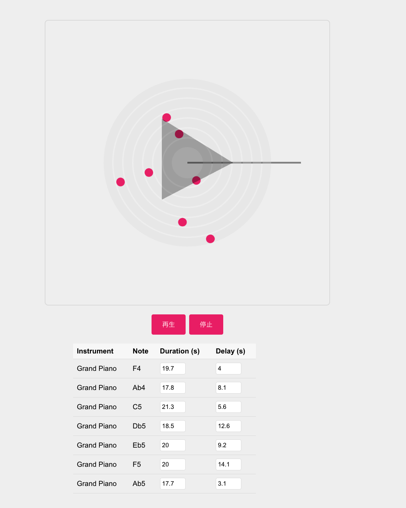

# Music for Airport Customizer
[デモサイト](https://musicforairports.vercel.app/) 


このアプリは授業の課題として作成したもので、「Music for Airport」を自分の好みに合わせて作り変えることができます。音の発生頻度や音楽の開始時間を設定することが可能です。



## Getting Started

このプロジェクトは [Create React App](https://github.com/facebook/create-react-app) を使用してブートストラップされました。

### インストールと起動方法

1. **リポジトリをクローンします**

   ```bash
   git clone https://github.com/your-username/music-for-airport-customizer.git
   cd music-for-airport-customizer
   ```

2. **依存パッケージをインストールします**

   ```bash
   npm install
   ```

3. **開発モードでアプリを起動します**

   ```bash
   npm start
   ```

   これにより、開発モードでアプリが起動します。\
   ブラウザで [http://localhost:3000](http://localhost:3000) を開いてアプリを確認できます。
